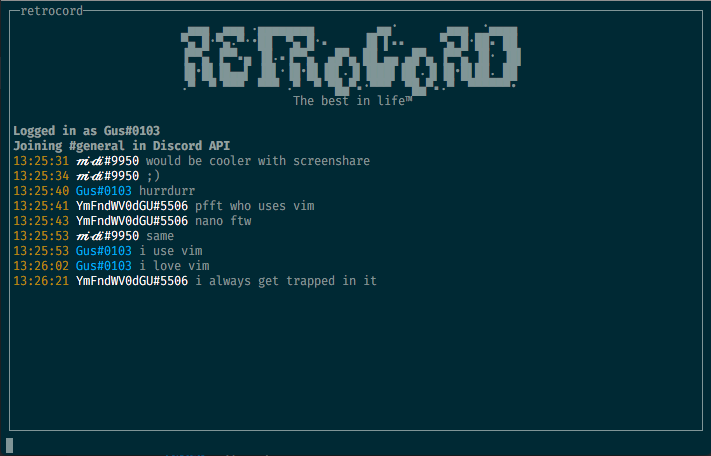
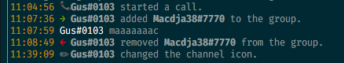
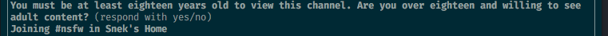
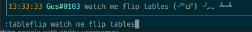

# RETROCORD
*__The best in life.__*

install with `npm i -g retrocord`

## Features
- Cool Commands
- Great integration with current Discord features
  - Message types
  - Search
  - NSFW channels
  - Custom emoji support, with nitro detection
  - ...and more!
- Customizable command prefix (defaults to `/`)
- Parses emojis for incoming and outgoing messages
- Smart mentions with support for mentioning impossible-to-mention unicode usernames

## Commands

- `login <token>` - login to the client
- `logout` - log the client out
- `join [guild|"dm"] <@user|#channel>` - join a channel
  - `join dm @vix`
  - `join discord api #general`
  - `join #testing` (if you are already scoped to a guild)
- `search <...query> [-options]` - search the currently selected channel
  - `search testing --limit=10 --has=image`
  - `search banned user --author-type=bot`
- `shrug [...text]` - discord-client-style shrug
- `tableflip [...text]` - discord-client-style tableflip
- `game [...text]` - set your current game
- `nick [...text]` - set your nick in the current guild, if in one
- `set <name> [value]` - set a setting in your `.retrorc`
- `q/quit/exit` - exit the client

## Gallery
Message Types  

NSFW Channels  

Tableflip Command  

